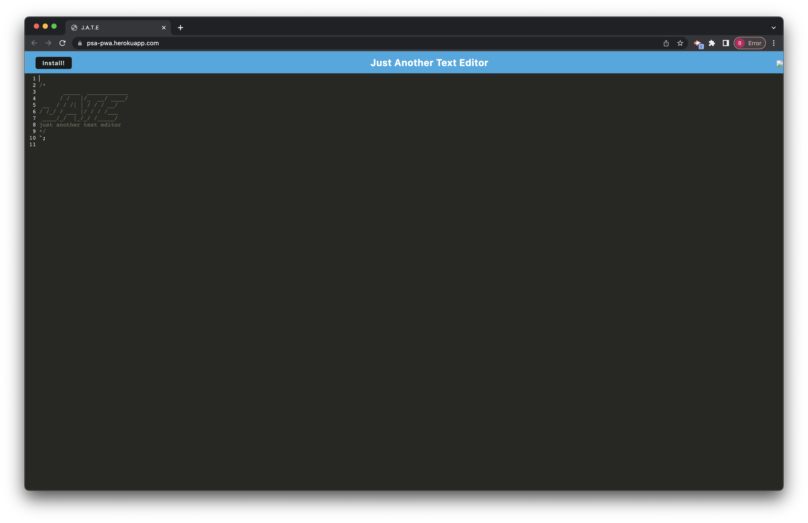

# PSA-PWA-Text-Editor

## Objective

- Given starter code for a text editor app, I am to make it function within a browser but also allow it to be installed and usedd offline.

## User Story

- AS A developer
- I WANT to create notes or code snippets with or without an internet connection
- SO THAT I can reliably retrieve them for later use

## Results

- I was able to successfully upload the text editor and deploy it on Heroku.
- As of me demoing it, it worked properly but the installation was bugged.

## Screenshot of Deployed Site

- 

## Deployed Link

- https://psa-pwa.herokuapp.com/

### Created by Brian Koo
